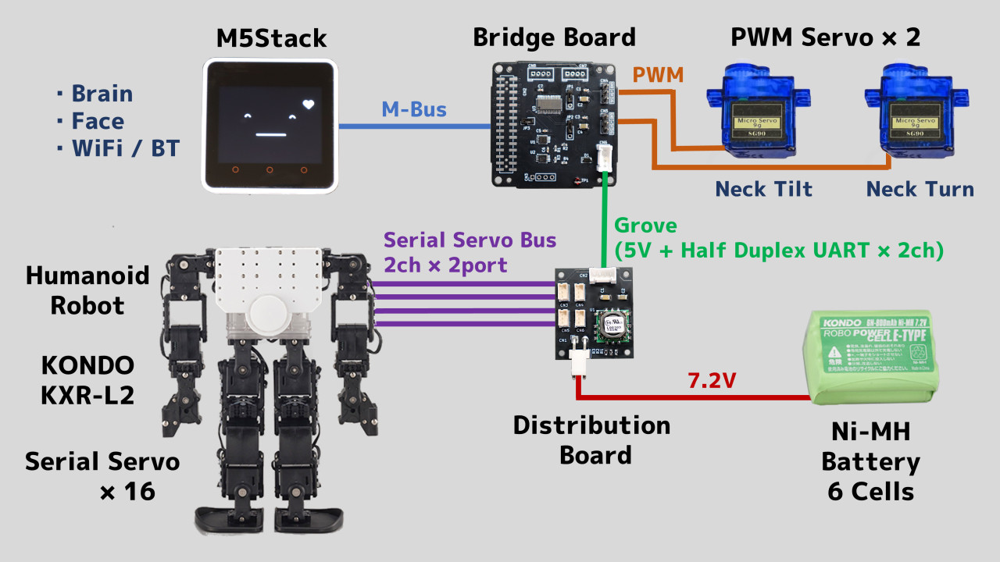

# ｽﾀｯｸﾁｬﾝぱわーど
[English](./README.md)

ｽﾀｯｸﾁｬﾝぱわーどは、M5Stackで作られたｽｰﾊﾟｰｶﾜｲｲ二足歩行ロボット制御ユニットです。

<!-- 動画埋め込み
## 動画

 -->
## システム構成

## 解説
* 日本語記事 → https://protopedia.net/prototype/6781
* 英語記事 → https://www.hackster.io/lipoyang/m5stack-as-a-humanoid-brain-b98882

## ファイル
* [firmware](./firmware/) : ファームウェアのソースコード
* [case](./case/) : メカ部品のSTEPファイルとSTLファイル
* [boards](./boards/) : プリント基板の回路図とパターン設計

## 原典
このプロジェクトはｽﾀｯｸﾁｬﾝにインスパイアされた派生作品です。[ｽﾀｯｸﾁｬﾝ](https://github.com/stack-chan/stack-chan)は[ししかわ](https://x.com/stack_chan)氏が開発、公開している、 手乗りサイズのｽｰﾊﾟｰｶﾜｲｲコミュニケーションロボットです。 
